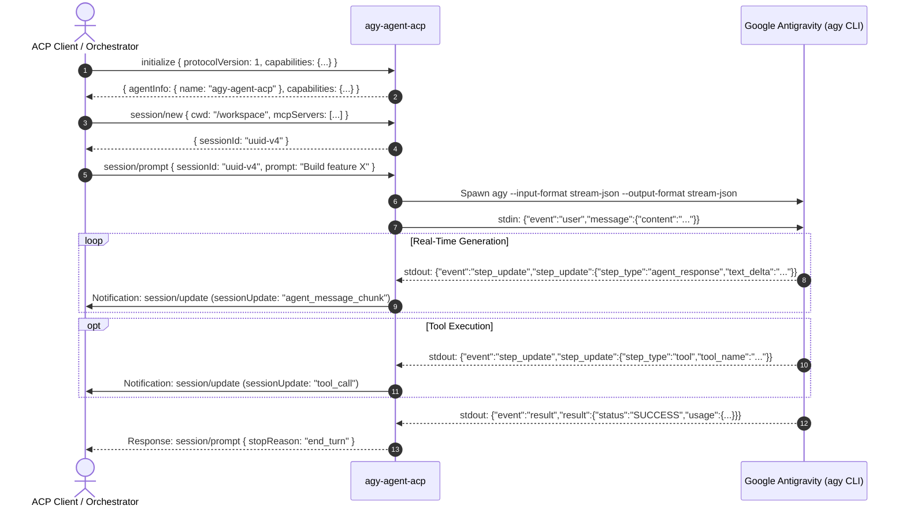

<div align="center">

# ⚡ agy-agent-acp

**Agent Client Protocol (ACP) Adapter for Google Antigravity CLI (`agy`)**

[](https://www.npmjs.com/package/agy-agent-acp)
[](https://opensource.org/licenses/MIT)
[](https://nodejs.org)
[](https://www.typescriptlang.org/)
[-purple?style=flat-square)](https://agentclientprotocol.org)
[](https://github.com/dongitran/agy-agent-acp/pulls)

<p align="center">
  Bridge Google Antigravity CLI's native reasoning engine with any headless agent orchestration harness over standard Agent Client Protocol (ACP).
</p>

</div>

---

## 🌟 Overview

**`agy-agent-acp`** is a high-performance, standard-compliant [Agent Client Protocol (ACP)](https://agentclientprotocol.org) adapter designed for **Google Antigravity CLI (`agy`)**.

While Google Antigravity provides state-of-the-art agentic AI coding capabilities, headless orchestration platforms (such as decentralized Nostr relays, CI/CD runners, chat bots, and multi-agent coordination hubs) communicate using standard JSON-RPC 2.0 ACP over `stdio`. 

`agy-agent-acp` bridges this gap: it receives ACP requests, manages the `agy` subprocess lifecycle in high-speed streaming mode (`--input-format stream-json --output-format stream-json`), and translates real-time reasoning deltas, tool executions, and usage telemetry back into standard ACP notification streams.

---

## 🏗 System Architecture

```
┌────────────────────────────────────────────────────────────────────────────────────────┐
│                              AGENT ORCHESTRATOR / HARNESS                               │
│              (e.g., Solace Buzz `buzz-acp`, custom ACP clients, MCP hubs)              │
└───────────────────────────────────────────┬────────────────────────────────────────────┘
                                            │ Standard Input / Output (stdio)
                                            │ Protocol: ACP (JSON-RPC 2.0)
                                            ▼
┌────────────────────────────────────────────────────────────────────────────────────────┐
│                                   agy-agent-acp                                        │
│  ┌──────────────────────────────────────────────────────────────────────────────────┐  │
│  │ 1. ACP Protocol Router (`src/agy-agent.ts`)                                      │  │
│  │    • Handles: initialize, session/new, session/prompt, session/cancel, etc.      │  │
│  │    • Translates internal stream events -> `sessionUpdate` ACP notifications      │  │
│  └────────────────────────────────────────┬─────────────────────────────────────────┘  │
│                                           │                                            │
│  ┌────────────────────────────────────────┴─────────────────────────────────────────┐  │
│  │ 2. Process Manager (`src/agy-process.ts`)                                        │  │
│  │    • Spawns & supervises: `agy --input-format stream-json --output-format ...`   │  │
│  │    • Line-buffered parser for `init`, `step_update`, `tool`, and `result`        │  │
│  │    • Graceful process tree lifecycle & cancellation handling                     │  │
│  └────────────────────────────────────────┬─────────────────────────────────────────┘  │
└───────────────────────────────────────────┼────────────────────────────────────────────┘
                                            │ stdin / stdout (stream-json line protocol)
                                            ▼
┌────────────────────────────────────────────────────────────────────────────────────────┐
│                            GOOGLE ANTIGRAVITY CLI (`agy`)                              │
│                   DeepMind Agentic Reasoning & Tool Execution Engine                   │
└────────────────────────────────────────────────────────────────────────────────────────┘
```

---

## ✨ Features

- ⚡ **Zero-Latency Streaming**: Transforms `agent_response` text deltas into real-time ACP `agent_message_chunk` updates as tokens are generated.
- 🛠 **Tool Execution Telemetry**: Captures tool calls, inputs, and outputs from `agy` and emits structured ACP `tool_call` updates.
- 🔄 **Full ACP Lifecycle Support**: Complete implementation of `initialize`, `session/new`, `session/prompt`, `session/cancel`, and `session/close`.
- 🧠 **Context & Prompt Injection**: Automatically mounts custom system prompt files (e.g. `system-prompt.md`) and preserves workspace directories (`cwd`).
- 📊 **Token Usage Metrics**: Tracks prompt, completion, and total tokens across conversational turns.
- 🛡 **Resilient Process Supervision**: Robust JSON line buffering, error recovery, signal escalation (`SIGTERM` $\rightarrow$ `SIGKILL`), and crash isolation.
- 🌐 **Docker & Multi-Arch Ready**: Built to operate seamlessly across Linux (x86_64 / arm64) and macOS environments.

---

## 🔁 Sequence Flow



---

## 🚀 Quick Start

### 1. Prerequisites

- **Node.js**: `v20.0.0` or higher
- **Google Antigravity CLI**: `agy` installed and authenticated on your machine (`agy auth login`)

### 2. Global Installation

Install globally via npm:

```bash
npm install -g agy-agent-acp
```

Or run directly using `npx`:

```bash
npx agy-agent-acp
```

### 3. Build From Source

```bash
# Clone repository
git clone https://github.com/dongitran/agy-agent-acp.git
cd agy-agent-acp

# Install dependencies
npm install

# Compile TypeScript
npm run build

# Package and link locally
npm link
```

---

## ⚙️ Configuration

`agy-agent-acp` can be customized via environment variables:

| Variable | Description | Default |
| :--- | :--- | :--- |
| `AGY_BIN` | Path to the `agy` executable | `agy` (resolved from `$PATH`) |
| `AGY_SYSTEM_PROMPT_FILE` | Optional path to custom system instructions file | `/home/agent/system-prompt.md` (if exists) |
| `DEBUG` | Enable verbose diagnostic logging to `stderr` | `0` (or `agy-agent-acp*`) |

---

## 🐳 Docker Deployment

To containerize `agy-agent-acp` inside headless production environments (such as Kubernetes or Docker Compose):

```dockerfile
FROM node:22-slim

# Install system dependencies
RUN apt-get update -qq && apt-get install -y -qq ca-certificates git bash curl \
    && rm -rf /var/lib/apt/lists/*

# Install agy-agent-acp
RUN npm install -g agy-agent-acp

# Set non-root user
USER node
WORKDIR /workspace

ENTRYPOINT ["agy-agent-acp"]
```

> [!TIP]
> Mount your host's authenticated `~/.gemini` folder and `agy` binary for zero-configuration authentication:
> ```yaml
> volumes:
>   - ~/.local/bin/agy:/usr/local/bin/agy:ro
>   - ~/.gemini:/home/node/.gemini:rw
> ```

---

## 🧪 ACP Protocol Methods

| ACP Method | Wire Type | Description |
| :--- | :--- | :--- |
| `initialize` | Request / Response | Negotiates client & agent capabilities and protocol versions. |
| `session/new` | Request / Response | Allocates a new conversation session and validates workspace directory. |
| `session/prompt` | Request / Response | Dispatches user instruction into `agy` and triggers turn execution. |
| `session/update` | Notification | Streams `agent_message_chunk`, `tool_call`, and `usage_update` events. |
| `session/cancel` | Request / Response | Interrupts running generation turns via process signals. |
| `session/close` | Request / Response | Cleans up session resources and terminates background processes. |

---

## 🛠 Development & Testing

```bash
# Run compiler in watch mode
npm run dev

# Run linter
npm run lint

# Build production bundle
npm run build
```

---

## 🤝 Contributing

Contributions, issues, and feature requests are welcome!

1. Fork the Project
2. Create your Feature Branch (`git checkout -b feature/AmazingFeature`)
3. Commit your Changes (`git commit -m 'feat: add AmazingFeature'`)
4. Push to the Branch (`git push origin feature/AmazingFeature`)
5. Open a Pull Request

---

## 📄 License

Distributed under the **MIT License**. See [`LICENSE`](./LICENSE) for more information.

---

<div align="center">
  <sub>Built with ❤️ by <a href="https://github.com/dongitran">@dongitran</a> for the Decentralized Agentic AI Ecosystem.</sub>
</div>
